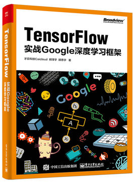

# TensorFlow 实战笔记

​	随着第八章结束，我将继续完成我的毕业设计，以及《TensorFlow机器学习项目实战》一书的研读，这里的笔记暂时告一段段落，等待之后将 chapter9、10 完善。

电子书下载链接：[\<\<Tensorflow：实战Google深度学习框架\>\>](http://www.olecn.com/download.php?id=5096)

> 参考:
>
> [TensorFlow_learning_notes](https://github.com/cookeem/TensorFlow_learning_notes) : 这里有些代码是 py2 ，主要是py3的，资源不全，主要参考内容。
>
> [tensorflow-tutorial](https://github.com/caicloud/tensorflow-tutorial) : 这里的代码是 py2 的，较为全面，但是 chapter8 有点迷，主要参考资源。
